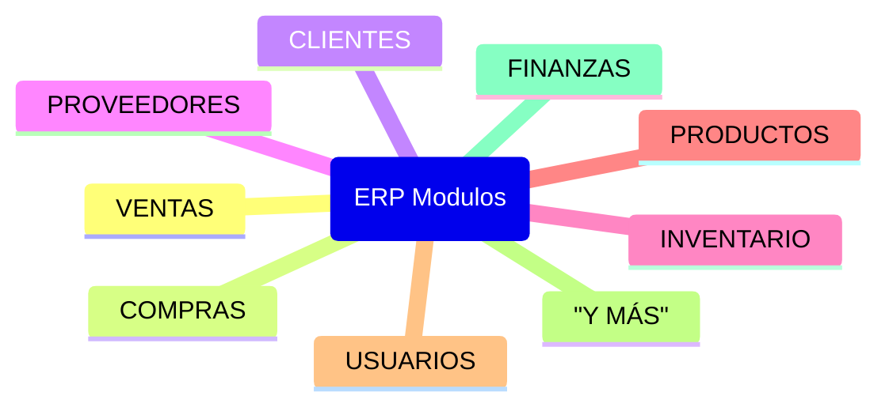

# ERP_Proyecto
Prototipo de un ERP con 9 módulos básicos e indispensables para  cada negocio, desde pequeñas empresas hasta mega empresas, el proyecto será desarrollado usando flask y python además de boostrap

## Modulos

## modelado de diagramas de BD 
- Modulo de Materiales

- Modulo de Proveedores

- Modulo de Clientes

- Modulo de Inventario

- Modulo de Contabilidad

- Modulo de Compras

